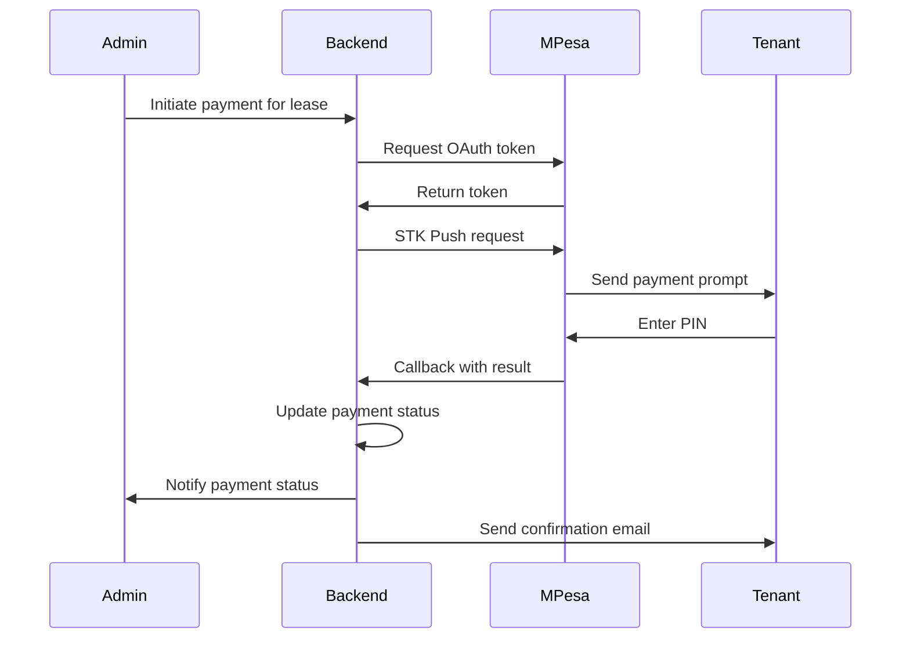

# Rental & Apartment Management System - Detailed Implementation Plan

## Executive Summary

This plan outlines the architecture and implementation strategy for a full-stack rental management system with strict role-based access control, admin-controlled M-Pesa payments, and multi-tenant and multi apartment or property management.

---

## User Review Required

> [!IMPORTANT]
> **Technology Stack Decisions**
> - **Backend**: Node.js + Express + TypeScript + Prisma + PostgreSQL
> - **Frontend**: Next.js 14+ (App Router) + TypeScript + Tailwind CSS
> - **Authentication**: JWT + bcrypt (with optional OAuth via NextAuth.js)
> - **File Storage**: AWS S3 or Cloudinary for property images
> - **Payment**: M-Pesa Daraja API (Kenya)
> 
> Please confirm if these choices align with your preferences or if you'd like alternatives.

> [!WARNING]
> **M-Pesa Integration Considerations**
> - M-Pesa credentials will be stored as environment variables accessible only to backend
> - Admin role will have exclusive access to payment processing endpoints
> - Payment reconciliation will be manual initially (auto-reconciliation in future)
> - You'll need M-Pesa Daraja API credentials (Consumer Key, Consumer Secret, Passkey)

> [!IMPORTANT]
> **Deployment Strategy**
> - **Frontend**: Vercel (recommended for Next.js)
> - **Backend**: Railway or Render
> - **Database**: Railway PostgreSQL or Supabase
> - **File Storage**: Cloudinary (free tier) or AWS S3
> 
> Confirm if you have preferences or existing accounts.

---

## Database Schema Design

### Core Tables

#### 1. **users**
```sql
id                UUID PRIMARY KEY
email             VARCHAR(255) UNIQUE NOT NULL
password_hash     VARCHAR(255) NOT NULL
role              ENUM('admin', 'landlord', 'tenant') NOT NULL
first_name        VARCHAR(100)
last_name         VARCHAR(100)
phone             VARCHAR(20)
profile_image_url TEXT
email_verified    BOOLEAN DEFAULT FALSE
is_active         BOOLEAN DEFAULT TRUE
created_at        TIMESTAMP DEFAULT NOW()
updated_at        TIMESTAMP DEFAULT NOW()
```

#### 2. **properties**
```sql
id              UUID PRIMARY KEY
name            VARCHAR(255) NOT NULL
address         TEXT NOT NULL
city            VARCHAR(100)
description     TEXT
amenities       TEXT[] -- Array of amenities
landlord_id     UUID REFERENCES users(id)
created_by      UUID REFERENCES users(id) -- Admin who created
is_active       BOOLEAN DEFAULT TRUE
created_at      TIMESTAMP DEFAULT NOW()
updated_at      TIMESTAMP DEFAULT NOW()
```

#### 3. **property_images**
```sql
id           UUID PRIMARY KEY
property_id  UUID REFERENCES properties(id) ON DELETE CASCADE
image_url    TEXT NOT NULL
is_primary   BOOLEAN DEFAULT FALSE
created_at   TIMESTAMP DEFAULT NOW()
```

#### 4. **units**
```sql
id                UUID PRIMARY KEY
property_id       UUID REFERENCES properties(id) ON DELETE CASCADE
unit_number       VARCHAR(50) NOT NULL
bedrooms          INTEGER NOT NULL
bathrooms         DECIMAL(3,1)
square_footage    INTEGER
rent_amount       DECIMAL(10,2) NOT NULL
security_deposit  DECIMAL(10,2)
status            ENUM('available', 'occupied', 'maintenance') DEFAULT 'available'
description       TEXT
created_at        TIMESTAMP DEFAULT NOW()
updated_at        TIMESTAMP DEFAULT NOW()

UNIQUE(property_id, unit_number)
```

#### 5. **unit_images**
```sql
id         UUID PRIMARY KEY
unit_id    UUID REFERENCES units(id) ON DELETE CASCADE
image_url  TEXT NOT NULL
is_primary BOOLEAN DEFAULT FALSE
created_at TIMESTAMP DEFAULT NOW()
```

#### 6. **applications**
```sql
id                  UUID PRIMARY KEY
unit_id             UUID REFERENCES units(id)
tenant_id           UUID REFERENCES users(id)
status              ENUM('pending', 'approved', 'rejected') DEFAULT 'pending'
landlord_notes      TEXT
admin_notes         TEXT
application_data    JSONB -- Store additional application info
created_at          TIMESTAMP DEFAULT NOW()
updated_at          TIMESTAMP DEFAULT NOW()
reviewed_by         UUID REFERENCES users(id)
reviewed_at         TIMESTAMP
```

#### 7. **leases**
```sql
id                UUID PRIMARY KEY
unit_id           UUID REFERENCES units(id)
tenant_id         UUID REFERENCES users(id)
start_date        DATE NOT NULL
end_date          DATE NOT NULL
rent_amount       DECIMAL(10,2) NOT NULL
payment_frequency ENUM('monthly', 'quarterly', 'annually') DEFAULT 'monthly'
security_deposit  DECIMAL(10,2)
terms             TEXT
status            ENUM('active', 'ended', 'terminated') DEFAULT 'active'
created_by        UUID REFERENCES users(id) -- Admin
created_at        TIMESTAMP DEFAULT NOW()
updated_at        TIMESTAMP DEFAULT NOW()
```

#### 8. **payments**
```sql
id                  UUID PRIMARY KEY
lease_id            UUID REFERENCES leases(id)
amount              DECIMAL(10,2) NOT NULL
payment_date        DATE NOT NULL
due_date            DATE NOT NULL
status              ENUM('pending', 'paid', 'overdue', 'failed') DEFAULT 'pending'
mpesa_reference     VARCHAR(100) UNIQUE
mpesa_phone_number  VARCHAR(20)
payment_method      VARCHAR(50) DEFAULT 'mpesa'
notes               TEXT
processed_by        UUID REFERENCES users(id) -- Admin who processed
created_at          TIMESTAMP DEFAULT NOW()
updated_at          TIMESTAMP DEFAULT NOW()
```

#### 9. **maintenance_requests**
```sql
id          UUID PRIMARY KEY
unit_id     UUID REFERENCES units(id)
tenant_id   UUID REFERENCES users(id)
category    VARCHAR(100)
description TEXT NOT NULL
priority    ENUM('low', 'medium', 'high', 'urgent') DEFAULT 'medium'
status      ENUM('open', 'in_progress', 'completed', 'cancelled') DEFAULT 'open'
assigned_to UUID REFERENCES users(id)
created_at  TIMESTAMP DEFAULT NOW()
updated_at  TIMESTAMP DEFAULT NOW()
completed_at TIMESTAMP
```

#### 10. **maintenance_comments**
```sql
id          UUID PRIMARY KEY
request_id  UUID REFERENCES maintenance_requests(id) ON DELETE CASCADE
user_id     UUID REFERENCES users(id)
comment     TEXT NOT NULL
created_at  TIMESTAMP DEFAULT NOW()
```

#### 11. **messages**
```sql
id          UUID PRIMARY KEY
sender_id   UUID REFERENCES users(id)
receiver_id UUID REFERENCES users(id)
subject     VARCHAR(255)
body        TEXT NOT NULL
is_read     BOOLEAN DEFAULT FALSE
created_at  TIMESTAMP DEFAULT NOW()
```

### Indexes
```sql
CREATE INDEX idx_users_email ON users(email);
CREATE INDEX idx_users_role ON users(role);
CREATE INDEX idx_properties_landlord ON properties(landlord_id);
CREATE INDEX idx_units_property ON units(property_id);
CREATE INDEX idx_units_status ON units(status);
CREATE INDEX idx_applications_tenant ON applications(tenant_id);
CREATE INDEX idx_applications_status ON applications(status);
CREATE INDEX idx_leases_tenant ON leases(tenant_id);
CREATE INDEX idx_leases_status ON leases(status);
CREATE INDEX idx_payments_lease ON payments(lease_id);
CREATE INDEX idx_payments_status ON payments(status);
CREATE INDEX idx_maintenance_unit ON maintenance_requests(unit_id);
CREATE INDEX idx_maintenance_status ON maintenance_requests(status);
```

---

## API Architecture

### Authentication Endpoints

| Method | Endpoint | Access | Description |
|--------|----------|--------|-------------|
| POST | `/api/auth/register` | Public | Register new user (tenant) |
| POST | `/api/auth/login` | Public | Login |
| POST | `/api/auth/logout` | Authenticated | Logout |
| POST | `/api/auth/forgot-password` | Public | Request password reset |
| POST | `/api/auth/reset-password` | Public | Reset password with token |
| GET | `/api/auth/me` | Authenticated | Get current user |

### User Management (Admin Only)

| Method | Endpoint | Access | Description |
|--------|----------|--------|-------------|
| GET | `/api/users` | Admin | List all users |
| GET | `/api/users/:id` | Admin | Get user details |
| POST | `/api/users/landlord` | Admin | Create landlord |
| PUT | `/api/users/:id` | Admin | Update user |
| DELETE | `/api/users/:id` | Admin | Soft delete user |
| PATCH | `/api/users/:id/activate` | Admin | Activate/deactivate user |

### Property Management

| Method | Endpoint | Access | Description |
|--------|----------|--------|-------------|
| GET | `/api/properties` | Admin, Landlord | List properties |
| GET | `/api/properties/:id` | Admin, Landlord | Get property details |
| POST | `/api/properties` | Admin, Landlord | Create property |
| PUT | `/api/properties/:id` | Admin, Landlord (own) | Update property |
| DELETE | `/api/properties/:id` | Admin, Landlord (own) | Delete property |
| POST | `/api/properties/:id/images` | Admin, Landlord (own) | Upload images |

### Unit Management

| Method | Endpoint | Access | Description |
|--------|----------|--------|-------------|
| GET | `/api/units` | Public | List available units (public listings) |
| GET | `/api/units/:id` | Public | Get unit details |
| POST | `/api/units` | Admin, Landlord | Create unit |
| PUT | `/api/units/:id` | Admin, Landlord (own) | Update unit |
| DELETE | `/api/units/:id` | Admin, Landlord (own) | Delete unit |
| POST | `/api/units/:id/images` | Admin, Landlord (own) | Upload images |

### Applications

| Method | Endpoint | Access | Description |
|--------|----------|--------|-------------|
| GET | `/api/applications` | Admin, Landlord, Tenant (own) | List applications |
| GET | `/api/applications/:id` | Admin, Landlord, Tenant (own) | Get application |
| POST | `/api/applications` | Tenant | Submit application |
| PATCH | `/api/applications/:id/review` | Landlord | Add landlord notes |
| PATCH | `/api/applications/:id/approve` | Admin | Approve application |
| PATCH | `/api/applications/:id/reject` | Admin | Reject application |

### Leases

| Method | Endpoint | Access | Description |
|--------|----------|--------|-------------|
| GET | `/api/leases` | Admin, Landlord, Tenant (own) | List leases |
| GET | `/api/leases/:id` | Admin, Landlord, Tenant (own) | Get lease details |
| POST | `/api/leases` | Admin | Create lease |
| PUT | `/api/leases/:id` | Admin | Update lease |
| PATCH | `/api/leases/:id/terminate` | Admin | Terminate lease |

### Payments (Admin-Controlled)

| Method | Endpoint | Access | Description |
|--------|----------|--------|-------------|
| GET | `/api/payments` | Admin (full), Landlord (read), Tenant (own) | List payments |
| GET | `/api/payments/:id` | Admin, Landlord (read), Tenant (own) | Get payment |
| POST | `/api/payments` | Admin | Create payment record |
| POST | `/api/payments/:id/process` | Admin | Process M-Pesa payment |
| PATCH | `/api/payments/:id/confirm` | Admin | Confirm payment |
| GET | `/api/payments/reports` | Admin | Financial reports |

### Maintenance Requests

| Method | Endpoint | Access | Description |
|--------|----------|--------|-------------|
| GET | `/api/maintenance` | Admin, Landlord, Tenant (own) | List requests |
| GET | `/api/maintenance/:id` | Admin, Landlord, Tenant (own) | Get request |
| POST | `/api/maintenance` | Tenant | Create request |
| PATCH | `/api/maintenance/:id/status` | Admin, Landlord | Update status |
| POST | `/api/maintenance/:id/comments` | Admin, Landlord, Tenant | Add comment |

### Messages

| Method | Endpoint | Access | Description |
|--------|----------|--------|-------------|
| GET | `/api/messages` | Authenticated | List messages |
| GET | `/api/messages/:id` | Authenticated (own) | Get message |
| POST | `/api/messages` | Authenticated | Send message |
| PATCH | `/api/messages/:id/read` | Authenticated (own) | Mark as read |

---

## Authorization Middleware Strategy

### Role-Based Access Control (RBAC)

```typescript
// Middleware: requireAuth
// Validates JWT token and attaches user to request

// Middleware: requireRole(...roles)
// Checks if user has required role

// Middleware: requireOwnership(resourceType)
// Checks if user owns the resource or is admin

// Example usage:
router.post('/api/properties', 
  requireAuth, 
  requireRole('admin', 'landlord'), 
  createProperty
);

router.get('/api/payments/:id', 
  requireAuth, 
  checkPaymentAccess, // Custom: Admin full, Landlord read, Tenant own
  getPayment
);
```

### Permission Matrix

| Resource | Admin | Landlord | Tenant |
|----------|-------|----------|--------|
| Users | Full CRUD | None | Own profile |
| Properties | Full CRUD | Own CRUD | Read public |
| Units | Full CRUD | Own CRUD | Read public |
| Applications | Approve/Reject | Review (own properties) | Submit/View own |
| Leases | Full CRUD | Read (own properties) | Read own |
| Payments | Full CRUD | Read (own properties) | Read own |
| Maintenance | Full CRUD | Manage (own properties) | Submit/View own |

---

## M-Pesa Integration Architecture

### Daraja API Flow

1. **STK Push (Lipa Na M-Pesa Online)**
   - Admin initiates payment request
   - Customer receives M-Pesa prompt on phone
   - Customer enters PIN
   - Callback received with payment status

2. **Implementation Steps**
   - Get OAuth token
   - Initiate STK Push
   - Handle callback
   - Update payment status

### Security Measures

- M-Pesa credentials stored in environment variables
- Callback URL validation
- Payment reconciliation logging
- Admin-only access to payment processing endpoints

### Payment Flow



---

## Frontend Architecture

### Tech Stack
- **Framework**: Next.js 14+ (App Router)
- **Language**: TypeScript
- **Styling**: Tailwind CSS
- **State Management**: React Context + hooks (or Zustand for complex state)
- **Forms**: React Hook Form + Zod validation
- **HTTP Client**: Axios or fetch
- **Authentication**: NextAuth.js or custom JWT handling

### Page Structure

```
app/
├── (public)/
│   ├── page.tsx                    # Home page
│   ├── listings/
│   │   ├── page.tsx                # Apartment listings
│   │   └── [id]/page.tsx           # Apartment details
│   ├── login/page.tsx
│   └── register/page.tsx
├── (tenant)/
│   ├── dashboard/page.tsx
│   ├── applications/page.tsx
│   ├── lease/page.tsx
│   ├── payments/page.tsx
│   ├── maintenance/page.tsx
│   ├── messages/page.tsx
│   └── profile/page.tsx
├── (landlord)/
│   ├── dashboard/page.tsx
│   ├── properties/
│   │   ├── page.tsx
│   │   ├── [id]/page.tsx
│   │   └── new/page.tsx
│   ├── units/
│   │   ├── page.tsx
│   │   └── new/page.tsx
│   ├── applications/page.tsx
│   ├── leases/page.tsx
│   ├── payments/page.tsx           # Read-only
│   ├── maintenance/page.tsx
│   └── messages/page.tsx
└── (admin)/
    ├── dashboard/page.tsx
    ├── users/page.tsx
    ├── properties/page.tsx
    ├── applications/page.tsx
    ├── leases/page.tsx
    ├── payments/
    │   ├── page.tsx
    │   └── process/page.tsx        # M-Pesa processing
    ├── maintenance/page.tsx
    ├── reports/page.tsx
    └── settings/page.tsx
```

### Component Architecture

```
components/
├── layout/
│   ├── Header.tsx
│   ├── Footer.tsx
│   ├── Sidebar.tsx
│   └── DashboardLayout.tsx
├── auth/
│   ├── LoginForm.tsx
│   ├── RegisterForm.tsx
│   └── ProtectedRoute.tsx
├── properties/
│   ├── PropertyCard.tsx
│   ├── PropertyForm.tsx
│   ├── PropertyList.tsx
│   └── ImageUpload.tsx
├── units/
│   ├── UnitCard.tsx
│   ├── UnitForm.tsx
│   └── UnitFilters.tsx
├── applications/
│   ├── ApplicationForm.tsx
│   ├── ApplicationList.tsx
│   └── ApplicationReview.tsx
├── payments/
│   ├── PaymentList.tsx
│   ├── PaymentForm.tsx
│   └── MPesaProcessor.tsx
├── maintenance/
│   ├── RequestForm.tsx
│   ├── RequestList.tsx
│   └── RequestDetails.tsx
└── common/
    ├── Button.tsx
    ├── Input.tsx
    ├── Modal.tsx
    ├── Table.tsx
    └── Pagination.tsx
```

---

## Backend Architecture

### Project Structure

```
src/
├── config/
│   ├── database.ts
│   ├── env.ts
│   └── mpesa.ts
├── middleware/
│   ├── auth.ts
│   ├── errorHandler.ts
│   ├── validation.ts
│   └── rbac.ts
├── routes/
│   ├── auth.routes.ts
│   ├── users.routes.ts
│   ├── properties.routes.ts
│   ├── units.routes.ts
│   ├── applications.routes.ts
│   ├── leases.routes.ts
│   ├── payments.routes.ts
│   ├── maintenance.routes.ts
│   └── messages.routes.ts
├── controllers/
│   ├── auth.controller.ts
│   ├── users.controller.ts
│   ├── properties.controller.ts
│   ├── units.controller.ts
│   ├── applications.controller.ts
│   ├── leases.controller.ts
│   ├── payments.controller.ts
│   ├── maintenance.controller.ts
│   └── messages.controller.ts
├── services/
│   ├── auth.service.ts
│   ├── email.service.ts
│   ├── mpesa.service.ts
│   ├── storage.service.ts
│   └── notification.service.ts
├── models/              # Prisma schema
│   └── schema.prisma
├── utils/
│   ├── jwt.ts
│   ├── bcrypt.ts
│   └── validators.ts
├── types/
│   └── index.ts
└── index.ts
```

### Key Services

#### 1. **M-Pesa Service**
```typescript
class MPesaService {
  async getAccessToken(): Promise<string>
  async initiateSTKPush(phoneNumber: string, amount: number, accountRef: string): Promise<any>
  async handleCallback(callbackData: any): Promise<void>
  async queryTransactionStatus(checkoutRequestID: string): Promise<any>
}
```

#### 2. **Email Service**
```typescript
class EmailService {
  async sendVerificationEmail(email: string, token: string): Promise<void>
  async sendPasswordResetEmail(email: string, token: string): Promise<void>
  async sendApplicationStatusEmail(email: string, status: string): Promise<void>
  async sendPaymentConfirmation(email: string, payment: Payment): Promise<void>
  async sendRentReminder(email: string, lease: Lease): Promise<void>
}
```

#### 3. **Storage Service**
```typescript
class StorageService {
  async uploadImage(file: Buffer, folder: string): Promise<string>
  async deleteImage(url: string): Promise<void>
  async uploadMultipleImages(files: Buffer[], folder: string): Promise<string[]>
}
```

---

## Security Implementation

### 1. Authentication
- Password hashing with bcrypt (salt rounds: 12)
- JWT tokens with expiration (access: 15min, refresh: 7 days)
- HTTP-only cookies for token storage
- CSRF protection

### 2. Authorization
- Role-based middleware on all protected routes
- Resource ownership validation
- Admin-only endpoints for sensitive operations

### 3. Input Validation
- Zod schemas for request validation
- SQL injection prevention via Prisma ORM
- XSS protection via input sanitization
- File upload validation (type, size)

### 4. Rate Limiting
- Login attempts: 5 per 15 minutes
- API requests: 100 per 15 minutes per IP
- M-Pesa callbacks: Whitelist Safaricom IPs

### 5. Environment Variables
```env
# Database
DATABASE_URL=postgresql://...

# JWT
JWT_SECRET=...
JWT_EXPIRES_IN=15m
REFRESH_TOKEN_SECRET=...
REFRESH_TOKEN_EXPIRES_IN=7d

# M-Pesa
MPESA_CONSUMER_KEY=...
MPESA_CONSUMER_SECRET=...
MPESA_PASSKEY=...
MPESA_SHORTCODE=...
MPESA_CALLBACK_URL=...
MPESA_ENVIRONMENT=sandbox|production

# Email
EMAIL_HOST=...
EMAIL_PORT=...
EMAIL_USER=...
EMAIL_PASSWORD=...

# Storage
CLOUDINARY_CLOUD_NAME=...
CLOUDINARY_API_KEY=...
CLOUDINARY_API_SECRET=...

# App
NODE_ENV=development|production
FRONTEND_URL=...
```

---

## Verification Plan

### Automated Tests

#### Backend Tests
```bash
# Unit tests
npm run test:unit

# Integration tests
npm run test:integration

# E2E tests
npm run test:e2e
```

**Test Coverage:**
- Authentication flows
- RBAC middleware
- Payment processing
- Application workflow
- Lease management

#### Frontend Tests
```bash
# Component tests
npm run test

# E2E tests (Playwright)
npm run test:e2e
```

**Test Coverage:**
- User registration/login
- Property browsing
- Application submission
- Dashboard rendering by role

### Manual Verification

1. **User Flows**
   - [ ] Tenant registration and application
   - [ ] Landlord property creation
   - [ ] Admin approval workflow
   - [ ] Payment processing
   - [ ] Maintenance request flow

2. **Security Testing**
   - [ ] Unauthorized access attempts
   - [ ] Role escalation attempts
   - [ ] M-Pesa credential protection
   - [ ] SQL injection attempts

3. **M-Pesa Integration**
   - [ ] Sandbox testing with test credentials
   - [ ] STK Push flow
   - [ ] Callback handling
   - [ ] Payment reconciliation

4. **Responsive Design**
   - [ ] Mobile view (375px)
   - [ ] Tablet view (768px)
   - [ ] Desktop view (1920px)

---

## Deployment Strategy

### Phase 1: Development Environment
- Local PostgreSQL database
- M-Pesa sandbox
- Local file storage

### Phase 2: Staging Environment
- Railway/Render backend
- Vercel frontend
- Railway PostgreSQL
- Cloudinary storage
- M-Pesa sandbox

### Phase 3: Production
- Same as staging but with:
  - Production M-Pesa credentials
  - SSL certificates
  - Domain configuration
  - Monitoring (Sentry, LogRocket)
  - Backup strategy

### CI/CD Pipeline
```yaml
# GitHub Actions example
on: [push]
jobs:
  test:
    - Run linting
    - Run tests
    - Build check
  deploy:
    - Deploy backend to Railway
    - Deploy frontend to Vercel
```

---

## Timeline Estimate

| Phase | Duration | Description |
|-------|----------|-------------|
| Setup & Infrastructure | 1 week | Database, auth, RBAC |
| User & Property Management | 1 week | CRUD operations |
| Application & Lease System | 1 week | Workflow implementation |
| Payment Integration | 1 week | M-Pesa integration |
| Frontend Development | 2 weeks | All dashboards and pages |
| Testing & Bug Fixes | 1 week | Comprehensive testing |
| Deployment & Documentation | 3 days | Production deployment |

**Total: ~7-8 weeks**

---

## Open Questions for User

1. **M-Pesa Credentials**: Do you already have Daraja API credentials, or do we need to guide you through registration?

2. **Email Service**: Preference for email provider (SendGrid, AWS SES, Mailgun)?

3. **File Storage**: Cloudinary (easier) or AWS S3 (more control)?

4. **Hosting Budget**: Any constraints on hosting costs?

5. **Multi-language Support**: Is internationalization needed initially?

6. **Tenant Screening**: Should we include credit check or background verification integrations?

7. **Document Management**: Should lease agreements be stored as PDFs?

8. **Reporting**: What specific financial reports do you need?

9. **Mobile App**: Priority for future mobile app (affects API design)?

10. **Existing System**: Is this replacing an existing system? Any data migration needed?
